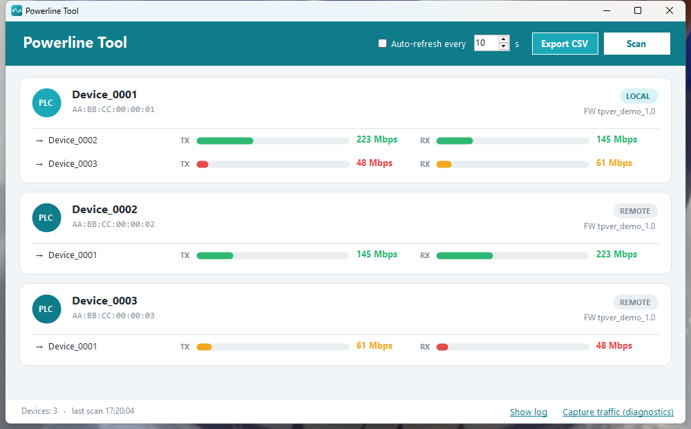

<div align="center">


# Powerline Tool

**Mala i pouzdana zamjena za TP-Linkov tpPLC na Windowsima.**
Pronađi powerline adaptere i vidi pravu brzinu veze među njima.

[English](README.md) · Hrvatski



</div>

> Snimka zaslona koristi `--demo` način rada (izmišljeni uređaji), pa sučelje možeš isprobati i bez adaptera.

## Zašto

tpPLC često ne vidi adaptere koji rade, zaglavi nakon nekoliko skeniranja i treba ga ponovno pokrenuti. Powerline Tool radi isti osnovni posao jednostavnije:

- **Skenira sve Ethernet kartice odjednom** (virtualne, VPN i Wi-Fi preskače), pa nikad ne "odabere krivu karticu".
- **Ponavlja svaki upit** umjesto da odustane nakon prvog izgubljenog paketa.
- **Razgovara s adapterima izravno** (sirovi Ethernet okviri preko Npcapa), bez pozadinskog procesa koji se može razići s prozorom.
- **Samo čita.** Adapterima postavlja samo upite, nikad ne mijenja lozinke, postavke ni firmware.

## Mogućnosti

- Pronalazi lokalne **i udaljene** adaptere
- **TX / RX brzina** po vezi uživo, u bojama (zeleno ≥ 100 Mbps, žuto ≥ 50, crveno ispod)
- Oznaka firmwarea svakog adaptera
- **Auto-osvježavanje** u intervalu po izboru
- **Preimenovanje uređaja** (sprema se lokalno, desni klik na karticu)
- **Izvoz u CSV**
- Ugrađeno **snimanje prometa** za dijagnostiku i dodavanje novih modela (vidi [CONTRIBUTING](CONTRIBUTING.md))
- Sučelje na engleskom i hrvatskom (prema jeziku Windowsa)

## Podržani hardver

| Obitelj čipova | Protokol | Status |
|---|---|---|
| Broadcom BCM60xxx (npr. **TP-Link TL-PA7017**) | EtherType `0x8912` | ✅ Testirano |
| Qualcomm Atheros (AR7400 / QCA7420 / QCA7500 …) | HomePlug AV `0x88E1` | ⚠️ Napisano prema javnoj dokumentaciji, **nije testirano na pravom uređaju** |

Ostali TP-Link modeli vjerojatno koriste jednu od te dvije obitelji, ali to je pretpostavka. Ako ga isprobaš na drugom adapteru, [otvori issue](../../issues/new/choose) i napiši što se dogodilo.

## Instalacija

1. Instaliraj **[Npcap](https://npcap.com)** (potreban za slanje i primanje sirovih Ethernet okvira). Zadane opcije su u redu.
2. Preuzmi `Powerline-Tool-win-x64.exe` sa stranice [Releases](../../releases) i pokreni. .NET je ugrađen, ništa drugo ne treba.
3. Ugasi tpPLC dok koristiš ovaj alat, jer dva programa koja istovremeno ispituju adaptere mogu jedan drugom smetati.

Računalo spoji mrežnim kabelom na powerline adapter. Spoj preko običnog (unmanaged) switcha je u redu.

## Korištenje

| Radnja | Kako |
|---|---|
| Skeniraj odmah | **Skeniraj** |
| Stalno osvježavaj | označi **Auto-osvježi svakih N s** |
| Preimenuj / kopiraj MAC | desni klik na karticu uređaja |
| Spremi rezultate | **Izvezi CSV** |
| Isprobaj bez adaptera | pokreni s `--demo` |
| Prisili jezik | pokreni s `--lang=en` ili `--lang=hr` |

## Gradnja iz izvornog koda

Treba [.NET 8 SDK](https://dotnet.microsoft.com/download).

```powershell
dotnet build -c Release
```

Jedna samostalna izvršna datoteka:

```powershell
dotnet publish src/PowerlineTool -c Release -r win-x64 --self-contained true `
  -p:PublishSingleFile=true -p:IncludeNativeLibrariesForSelfExtract=true -p:EnableCompressionInSingleFile=true
```

## Kako radi

Adapteri odgovaraju na nekoliko upravljačkih poruka poslanih kao sirovi Ethernet okviri. Broadcomov protokol je otkriven snimanjem onoga što tpPLC šalje na autorovoj vlastitoj mreži i ponavljanjem upita koji samo čitaju. Što se zna, a što je još pretpostavka, piše u **[docs/PROTOCOL.md](docs/PROTOCOL.md)** (na engleskom).

## Poznata ograničenja

- Samo Windows (Npcap + WinForms).
- Koji je adapter "lokalni" određuje se heuristikom koja se na testiranom paru poklapa s tpPLC-om, ali nije dokazana općenito.
- Brzine su prikazane kako ih adapter javlja (`vrijednost & 0x3FFF`). Na testiranom paru poklapaju se s tpPLC-om (oko 210 prema 212 Mbps), ali značenje gornjih bitova je pretpostavka.
- Nema ažuriranja firmwarea, promjene lozinke, LED-a ni štednje energije. Te naredbe još nisu snimljene.

## Odricanje

Nije povezano s TP-Linkom, niti ga TP-Link podržava ili preporučuje. "TP-Link" i "tpPLC" su zaštitni znakovi njihovih vlasnika. Projekt ne sadrži TP-Linkov kod ni materijale. Detalji protokola uočeni su iz mrežnog prometa na autorovim vlastitim uređajima radi interoperabilnosti. Koristiš na vlastitu odgovornost.

## Licenca

[MIT](LICENSE)

