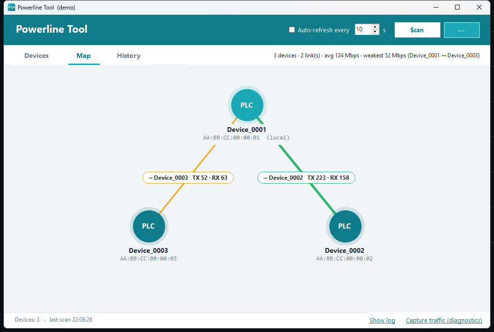
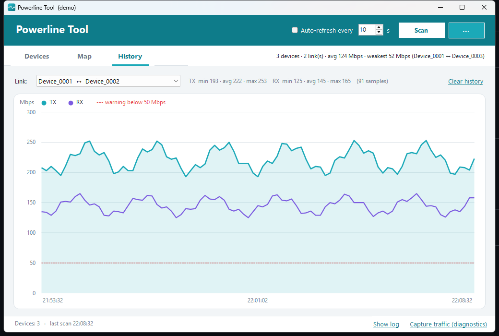
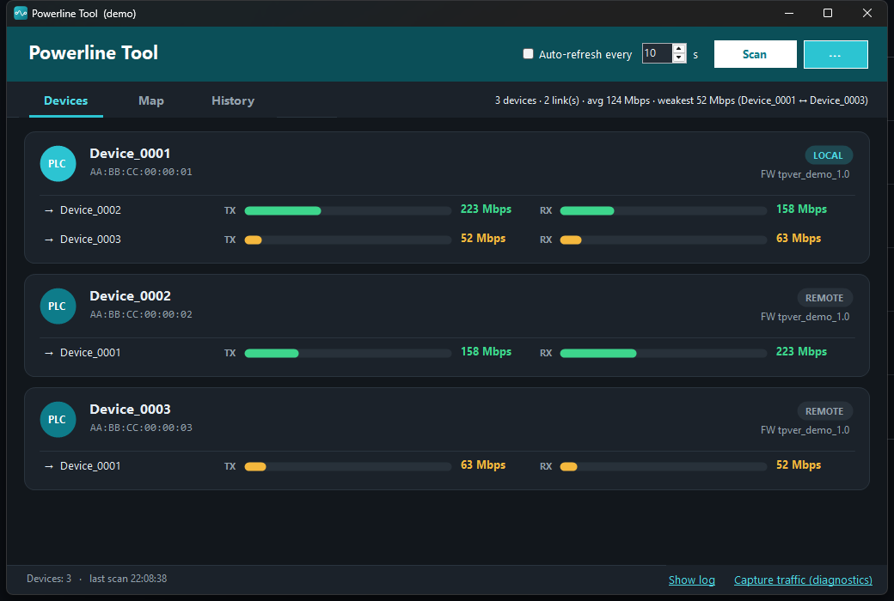

<div align="center">


# Powerline Tool

**A small, reliable Windows replacement for TP-Link's tpPLC utility.**
Find your powerline adapters, watch the real link speed between them, and get told when a link drops.

[](https://github.com/TheFullyNormalWorkindCoder/powerline-tool/actions/workflows/build.yml)
[](https://github.com/TheFullyNormalWorkindCoder/powerline-tool/releases/latest)
[](https://github.com/TheFullyNormalWorkindCoder/powerline-tool/releases)


English · [Hrvatski](README.hr.md)


</div>

> Every screenshot here uses `--demo` mode (fake devices), so you can try the whole interface without any hardware.

<table>
<tr>
<td width="33%"><br><sub><b>Map</b>: adapters and links, thickness and colour follow the speed</sub></td>
<td width="33%"><br><sub><b>History</b>: TX/RX over time with a warning line</sub></td>
<td width="33%"><br><sub><b>Dark theme</b>: follows Windows, or pick one</sub></td>
</tr>
</table>

## Why

tpPLC regularly fails to see adapters that are plugged in and working, gets stuck after a few scans, and needs a restart to recover. Powerline Tool does the same core job in a simpler way:

- **Scans every Ethernet card at once** (virtual, VPN and Wi-Fi adapters are skipped), so it never "picks the wrong card".
- **Retries every request** instead of giving up on the first lost frame.
- **Talks to adapters directly** (raw Ethernet frames through Npcap). There is no background helper process that can get out of sync with the window.
- **Read-only.** It only asks adapters for information. It never changes passwords, settings or firmware.
- **No telemetry, no accounts.** The only network request it can make is "Check for updates", and only when you click it.

## Features

**See your network**
- Local **and remote** adapters (the ones at the other end of your mains wiring)
- Live **TX / RX** speed per link, with a quality rating (Poor / Fair / Good / Excellent)
- **Map** view and a one-line **summary**: device count, average speed, weakest link
- Firmware, network ID and which network card each adapter was found on (hover a card)

**Keep an eye on it**
- **History chart** per link, with min / avg / max and a warning line
- **Auto-refresh** at an interval you choose
- **Notifications** when a device disappears or comes back, or a link drops below your threshold
- Runs in the **system tray**, optionally **starts with Windows** (minimised)
- Optional **history log** to CSV for your own graphs

**Handy**
- Rename devices (stored locally), copy MAC, export **CSV** or **JSON**, copy a text summary
- Light / dark theme, English / Croatian
- Single instance (a second launch just brings the first to the front)
- Built-in **traffic capture** that makes adding new adapter models possible ([CONTRIBUTING](CONTRIBUTING.md))

## Supported hardware

| Chipset family | Protocol | Status |
|---|---|---|
| Broadcom BCM60xxx (e.g. **TP-Link TL-PA7017**) | EtherType `0x8912` | ✅ Tested |
| Qualcomm Atheros (AR7400 / QCA7420 / QCA7500 …) | HomePlug AV `0x88E1` | ⚠️ Implemented from public documentation, **not tested on real hardware** |

Other TP-Link models probably use one of these two families, but that is a guess. If you try it on another adapter, please [open an issue](https://github.com/TheFullyNormalWorkindCoder/powerline-tool/issues/new/choose) and say what happened.

## Install

1. Install **[Npcap](https://npcap.com)** (needed to send and receive raw Ethernet frames). Defaults are fine.
2. Download `Powerline-Tool-win-x64.exe` from the [latest release](https://github.com/TheFullyNormalWorkindCoder/powerline-tool/releases/latest) and run it. .NET is bundled, nothing else to install.
3. Close tpPLC while using this tool, because two programs querying the adapters can interfere with each other.

Connect the computer to a powerline adapter with a network cable. Being behind an unmanaged switch is fine.

**Verify the download** (optional): each release lists a SHA-256 hash.

```powershell
(Get-FileHash .\Powerline-Tool-win-x64.exe -Algorithm SHA256).Hash
```

Windows SmartScreen may warn about an unsigned app from an unknown publisher; choose *More info → Run anyway* if the hash matches.

## Usage

| Action | How |
|---|---|
| Scan now | **Scan** or `F5` |
| Switch view | **Devices / Map / History** or `Ctrl+1/2/3` |
| Rename, copy MAC, show history | right-click a device card |
| Settings (theme, language, thresholds, tray, startup) | `⋯` menu → Settings, or `Ctrl+,` |
| Export | `⋯` menu → CSV (`Ctrl+E`) / JSON / copy summary |
| Show or hide the log | `Ctrl+L` |

Command-line switches: `--demo` (fake devices), `--lang=en` or `--lang=hr`, `--theme=light` or `--theme=dark`, `--page=devices|map|history`, `--minimized`.

Files live in `%APPDATA%\PowerlineTool`: `settings.json` (settings and device names) and, if enabled, `history.csv`.

## Troubleshooting

**"No powerline adapter found"**
1. Is **Npcap** installed? (The app tells you if it is missing.)
2. Is **tpPLC closed**? Quit it from the tray too.
3. Is the computer connected to the adapter with a **cable** (not Wi-Fi) and is the link light on?
4. Open the log (`Ctrl+L`) and press **Scan**. If frames arrive but nothing is recognised, your model speaks a variant of the protocol this tool does not know yet. Use *Capture traffic* and attach the file to an [adapter report](https://github.com/TheFullyNormalWorkindCoder/powerline-tool/issues/new/choose).

**Speeds look different from tpPLC.** Both read the same value from the adapter, and powerline rates fluctuate with electrical noise from second to second.

## Build from source

Requires the [.NET 8 SDK](https://dotnet.microsoft.com/download).

```powershell
dotnet build -c Release
dotnet test  -c Release                       # protocol parsing, change detection, history, settings
dotnet run --project src/PowerlineTool -- --demo
```

Single self-contained executable:

```powershell
dotnet publish src/PowerlineTool -c Release -r win-x64 --self-contained true `
  -p:PublishSingleFile=true -p:IncludeNativeLibrariesForSelfExtract=true -p:EnableCompressionInSingleFile=true
```

Regenerate the screenshots: `powershell -File tools/make-screenshots.ps1`.

## How it works

The adapters answer a handful of management messages sent as raw Ethernet frames. The Broadcom protocol was worked out by capturing what tpPLC sends on the author's own network and replaying the read-only requests. Everything that is known, and everything that is still a guess, is written down in **[docs/PROTOCOL.md](docs/PROTOCOL.md)**; the code layout is in **[docs/ARCHITECTURE.md](docs/ARCHITECTURE.md)**.

## Known limitations

- Windows only (Npcap + WinForms).
- Which adapter is "local" is decided with a heuristic that matched tpPLC on the tested pair, but is not proven in general.
- Speeds are shown as the adapter reports them (`value & 0x3FFF`). They matched tpPLC (about 210 Mbps vs 212) on the tested pair, but the meaning of the high bits is a guess.
- No firmware update, password change, LED, restart or power-saving control. Those commands have not been captured, and the tool is deliberately read-only.
- The Qualcomm code path has never run against a real adapter.

## Contributing

Testing on other adapter models is the most valuable help. See [CONTRIBUTING.md](CONTRIBUTING.md). Changes are listed in the [CHANGELOG](CHANGELOG.md); security reports go through [SECURITY.md](SECURITY.md).

## Disclaimer

Not affiliated with, endorsed by, or supported by TP-Link. "TP-Link" and "tpPLC" are trademarks of their respective owners. This project contains no TP-Link code or assets. Protocol details were observed from network traffic on the author's own devices for the purpose of interoperability. Use at your own risk.

## License

[MIT](LICENSE)
