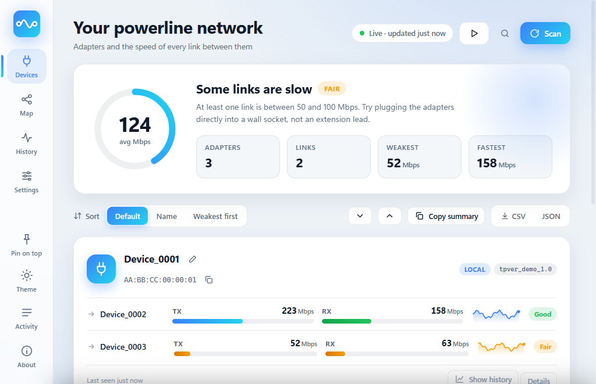
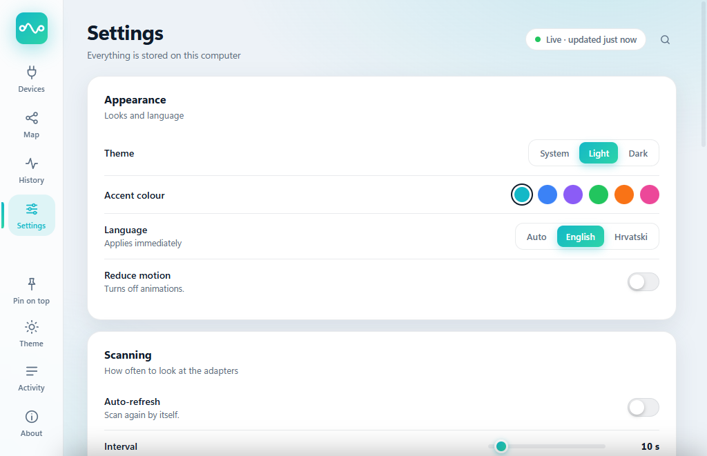

<div align="center">


# Powerline Tool

**A small, reliable Windows replacement for TP-Link's tpPLC utility.**
Find your powerline adapters, watch the real speed of every link, and get told when one drops.

[](https://github.com/TheFullyNormalWorkindCoder/powerline-tool/actions/workflows/build.yml)
[](https://github.com/TheFullyNormalWorkindCoder/powerline-tool/releases/latest)
[](https://github.com/TheFullyNormalWorkindCoder/powerline-tool/releases)


English · [Hrvatski](README.hr.md)


</div>

> **Unofficial project.** This is an independent, community tool. It is **not made, endorsed, supported or affiliated with TP-Link** in any way. "TP-Link" and "tpPLC" are trademarks of their owners and are used here only to say which hardware and which program this tool is compatible with or replaces.

> Every screenshot here uses `--demo` mode (fake devices), so you can try the whole interface without any hardware.

<table>
<tr>
<td width="50%"><br><sub><b>Map</b>: adapters and links, line thickness and colour follow the speed, the flow animates faster on faster links</sub></td>
<td width="50%"><br><sub><b>History</b>: TX/RX per link with hover values, range buttons, min / average / max</sub></td>
</tr>
<tr>
<td><br><sub><b>Light theme</b> with another accent colour. Follows Windows or set by hand</sub></td>
<td><br><sub><b>Settings</b>: theme, accent, language, thresholds, tray, startup, tools</sub></td>
</tr>
</table>

## Why

tpPLC regularly fails to see adapters that are plugged in and working, gets stuck after a few scans, and needs a restart to recover. Powerline Tool does the same core job in a simpler way:

- **Scans every Ethernet card at once** (virtual, VPN and Wi-Fi adapters are skipped, and it tells you which and why), so it never "picks the wrong card".
- **Retries and remembers.** A lost reply does not make the adapter vanish: it stays on screen as "not seen" for a few scans, and an empty scan is repeated once before it is believed.
- **Talks to adapters directly** (raw Ethernet frames through Npcap). There is no background helper process that can get out of sync with the window.
- **Says what is wrong.** "Only the local adapter answers", "partner not answering", "tpPLC is running at the same time", "Npcap missing": an empty screen always comes with a reason.
- **Read-only.** It only asks adapters for information. It never changes passwords, settings or firmware.
- **No telemetry, no accounts.** The only network request it can make is "Check for updates", and only when you click it.

## Features

**See your network**
- Local **and remote** adapters, firmware, network ID, and which card each was found on
- Live **TX / RX** speed per link with a quality rating (Poor / Fair / Good / Excellent), sparklines, and a **health gauge** with a plain-language summary
- **Map** of the network and a **history chart** per link
- A link the local adapter lists but that does not answer is shown as **no link / offline**, not as "0 Mbps"

**Keep an eye on it**
- **Auto-refresh** with a countdown ring; pause and resume with one click
- **Notifications** when an adapter disappears or returns, or a link falls below your threshold
- **System tray**, optional **start with Windows**, optional **always on top**
- Optional **history log** to CSV

**Handy**
- Rename devices, copy MAC, **sort** cards, expand all, **copy a text summary**, export **CSV / JSON**, save a link's history as CSV
- **Command palette** (`Ctrl+K` or `/`) and keyboard shortcuts
- **Diagnostics for a bug report** in one click (versions, cards, results, log; MAC addresses shortened)
- Light / dark theme, six accent colours, English / Croatian, reduced-motion option, responsive layout
- Single instance: launching it twice just brings the first window forward
- Built-in **traffic capture** that makes adding new adapter models possible ([CONTRIBUTING](CONTRIBUTING.md))

## Supported hardware

| Chipset family | Protocol | Status |
|---|---|---|
| Broadcom BCM60xxx (e.g. **TP-Link TL-PA7017**) | EtherType `0x8912` | ✅ Tested |
| Qualcomm Atheros (AR7400 / QCA7420 / QCA7500 …) | HomePlug AV `0x88E1` | ⚠️ Implemented from public documentation, **not tested on real hardware** |

Other TP-Link models probably use one of these two families, but that is a guess. If you try it on another adapter, please [open an issue](https://github.com/TheFullyNormalWorkindCoder/powerline-tool/issues/new/choose) and say what happened (the *Diagnostics* button in Settings gives you the text to paste).

## What has been tested (and what has not)

Everything below was tested by **one person on one PC**. Treat anything not in the first table as unverified.

**Test setup:** Windows 11 Home (build 26300), Npcap 1.89, one pair of **TP-Link TL-PA7017** adapters (Broadcom, firmware id `tpver_701E14_190426_901`), the PC connected to the local adapter through a 100 Mbps unmanaged switch.

| Verified on the real hardware above | |
|---|---|
| Finding the local and the remote adapter, reading the firmware id | ✅ (repeated scans, headless and in the window) |
| TX / RX link speeds | ✅ matched tpPLC within the normal fluctuation (about 210 in tpPLC vs 212 and 223 in this tool, read at different moments) |
| The new interface running in WebView2 against the real adapters: local adapter, firmware, names imported from version 1.0, and the "only the local adapter answers" state | ✅ |
| Concurrent scanners (two instances of the scanner at once) | ✅ no interference |
| The classic window (`--classic`) | ✅ live scan in 1.1; in 1.2 it was only started in `--demo` mode |

| Tested only with fake data (`--demo`), in a browser with demo data, or in unit tests | |
|---|---|
| Map, history chart, sorting, command palette, settings page, accent colours | demo data |
| The "link down" view (a partner the local adapter lists with 0/0 that never answers) | simulated in a browser; on the real network the adapter showed this for a short while, before the view existed |
| A two-adapter network drawn by the **new** interface from live data | the live two-adapter reading was verified headless; at the moment the new window was run, the remote adapter did not answer |
| Device memory, retry, change detection, history store, settings file, CSV format, JSON state | unit tests (70), using frames and values modelled on the capture, not live traffic |

| **Not tested** | |
|---|---|
| Qualcomm Atheros adapters (the `0x88E1` code path) | never run against real hardware |
| Any adapter model other than the TL-PA7017; more than two adapters on a real network | not tested |
| Windows 10, ARM64, other display scaling, other Npcap versions, machines without the WebView2 runtime (should fall back to the classic window) | not tested |
| Wi-Fi adapters | skipped by design; not tested |
| Tray notifications, minimise to tray, start with Windows, single-instance wake-up, always on top | not tested |
| Export and save buttons end to end, *Check for updates* against the live GitHub API | not tested manually |
| Croatian interface in the new window on a Croatian Windows | seen in screenshots only |
| The downloadable single-file `.exe` built by GitHub Actions | the author has not run it |

Found something that behaves differently? Please [open an issue](https://github.com/TheFullyNormalWorkindCoder/powerline-tool/issues/new/choose).

## Install

1. Install **[Npcap](https://npcap.com)** (needed to send and receive raw Ethernet frames). Defaults are fine.
2. Download `Powerline-Tool-win-x64.exe` from the [latest release](https://github.com/TheFullyNormalWorkindCoder/powerline-tool/releases/latest) and run it. .NET is bundled.
3. The modern interface uses the **Microsoft Edge WebView2 runtime**, which ships with Windows 11 and most up-to-date Windows 10. If it is missing, the app opens the classic window instead.
4. Close tpPLC while using this tool, because two programs querying the adapters can interfere with each other. The app warns you if it sees tpPLC running.

Connect the computer to a powerline adapter with a network cable. Being behind an unmanaged switch is fine.

**Verify the download** (optional): each release lists a SHA-256 hash.

```powershell
(Get-FileHash .\Powerline-Tool-win-x64.exe -Algorithm SHA256).Hash
```

Windows SmartScreen may warn about an unsigned app from an unknown publisher; choose *More info → Run anyway* if the hash matches.

## Usage

| Action | How |
|---|---|
| Scan now | **Scan**, `F5` or `R` |
| Switch page | sidebar, or `1` `2` `3` `4` |
| Find any command | `Ctrl+K` or `/` |
| Rename, copy MAC, history of a device | on the device card |
| Settings | sidebar → Settings |
| Activity feed and log | sidebar → Activity, or `L` |
| Shortcut help | `?` |

Command-line switches: `--demo` (fake devices), `--lang=en` or `--lang=hr`, `--theme=light` or `--theme=dark`, `--accent=teal|blue|violet|green|orange|pink`, `--page=devices|map|history|settings|about`, `--minimized`, `--classic`, `--devtools`, `--shot=file.png` (save a picture of the window and exit).

Files live in `%APPDATA%\PowerlineTool`: `settings.json` (settings and device names), `WebView2\` (the web view's profile) and, if enabled, `history.csv`.

## Troubleshooting

**"No powerline adapter found"** (the screen lists these steps too)
1. Is **Npcap** installed?
2. Is **tpPLC closed**? Quit it from the tray too.
3. Is the computer connected to the adapter with a **cable** (not Wi-Fi) and is the link light on?
4. Open the activity drawer (`L`) and press **Scan**. If frames arrive but nothing is recognised, your model speaks a variant of the protocol this tool does not know yet. Use *Capture traffic* in Settings and attach the file to an [adapter report](https://github.com/TheFullyNormalWorkindCoder/powerline-tool/issues/new/choose).

**"Only the local adapter answers"** The adapter plugged into this PC replies, but no partner does. Check that the other adapter is powered, paired and in a wall socket (not an extension lead), then press Scan again.

**Speeds look different from tpPLC.** Both read link rates from the adapter, and powerline rates fluctuate with electrical noise from second to second.

## Build from source

Requires the [.NET 8 SDK](https://dotnet.microsoft.com/download).

```powershell
dotnet build -c Release
dotnet test  -c Release                       # parsing, memory, retry, change detection, history, settings, UI state
dotnet run --project src/PowerlineTool -- --demo
```

The interface is plain HTML/CSS/JS in `src/PowerlineTool/ui` and is compiled into the exe. Opened in an ordinary browser (any static file server), it runs on built-in demo data, so you can work on it without Windows or hardware. Add `?theme=light&lang=hr&accent=violet&page=map` to the address to preview variants.

Single self-contained executable:

```powershell
dotnet publish src/PowerlineTool -c Release -r win-x64 --self-contained true `
  -p:PublishSingleFile=true -p:IncludeNativeLibrariesForSelfExtract=true -p:EnableCompressionInSingleFile=true
```

Regenerate the screenshots: `powershell -File tools/make-screenshots.ps1`.

## How it works

The adapters answer a handful of management messages sent as raw Ethernet frames. The Broadcom protocol was worked out by capturing what tpPLC sends on the author's own network and replaying the read-only requests. Everything that is known, and everything that is still a guess, is written down in **[docs/PROTOCOL.md](docs/PROTOCOL.md)**; the code layout and how the web interface talks to C# are in **[docs/ARCHITECTURE.md](docs/ARCHITECTURE.md)**.

## Known limitations

- Windows only (Npcap + WebView2/WinForms).
- Which adapter is "local" is decided with a heuristic that matched tpPLC on the tested pair, but is not proven in general.
- Speeds are shown as the adapter reports them (`value & 0x3FFF`). They matched tpPLC (about 210 Mbps vs 212) on the tested pair, but the meaning of the high bits is a guess.
- A partner that never answers the first discovery is only known by the MAC address the local adapter lists, so it is shown without firmware.
- No firmware update, password change, LED, restart or power-saving control. Those commands have not been captured, and the tool is deliberately read-only.
- The Qualcomm code path has never run against a real adapter.

## Third-party components

| Component | Licence | Notes |
|---|---|---|
| [SharpPcap](https://github.com/chmorgan/sharppcap) 6.3.0 | MIT | Raw packet access |
| [PacketDotNet](https://github.com/dotpcap/packetnet) 1.4.7 | MPL-2.0 | Pulled in by SharpPcap; used **unmodified**, its source is at the link |
| [Microsoft.Web.WebView2](https://www.nuget.org/packages/Microsoft.Web.WebView2) 1.0.2903.40 | Microsoft BSD-style licence | Shows the interface; the WebView2 *runtime* is a Windows component and is not bundled |
| .NET 8 runtime | MIT | Bundled inside the single-file `.exe` |
| [Npcap](https://npcap.com) | Npcap licence | **Not** bundled; you install it yourself |

The interface itself uses no external fonts, scripts, icons or images.

## Contributing

Testing on other adapter models is the most valuable help. See [CONTRIBUTING.md](CONTRIBUTING.md). Changes are listed in the [CHANGELOG](CHANGELOG.md); security reports go through [SECURITY.md](SECURITY.md).

## Disclaimer

Not affiliated with, endorsed by, or supported by TP-Link. "TP-Link" and "tpPLC" are trademarks of their respective owners. This project contains no TP-Link code or assets. Protocol details were observed from network traffic on the author's own devices for the purpose of interoperability. Use at your own risk.

## License

[MIT](LICENSE)
